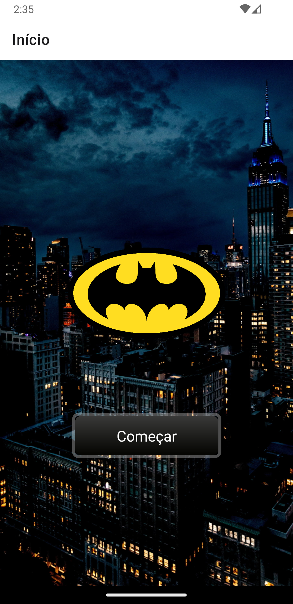
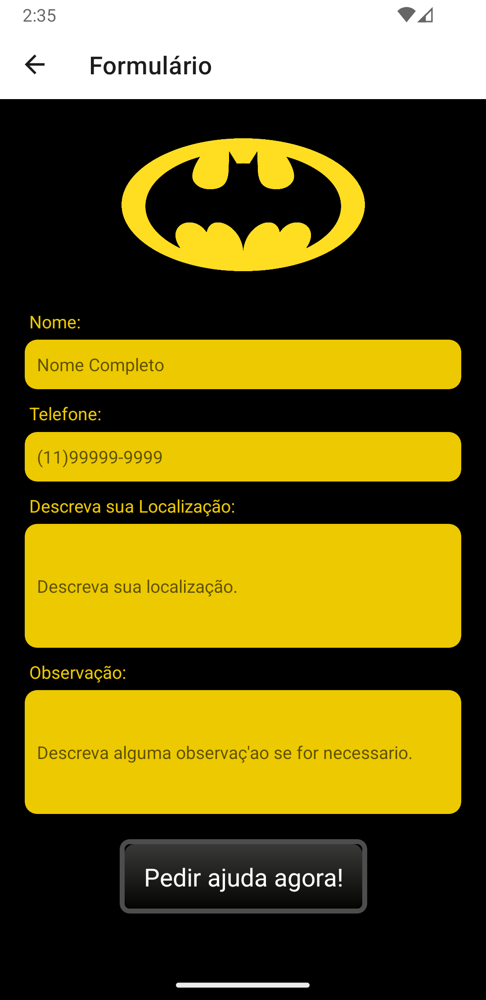
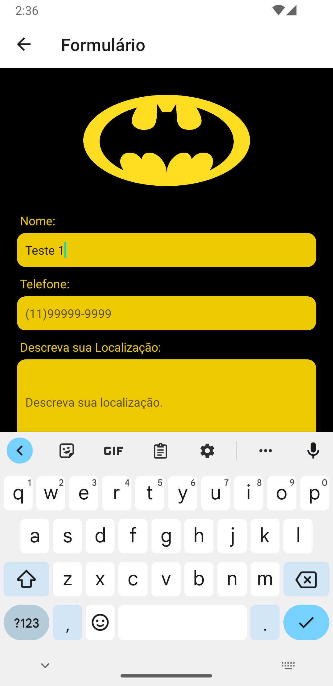
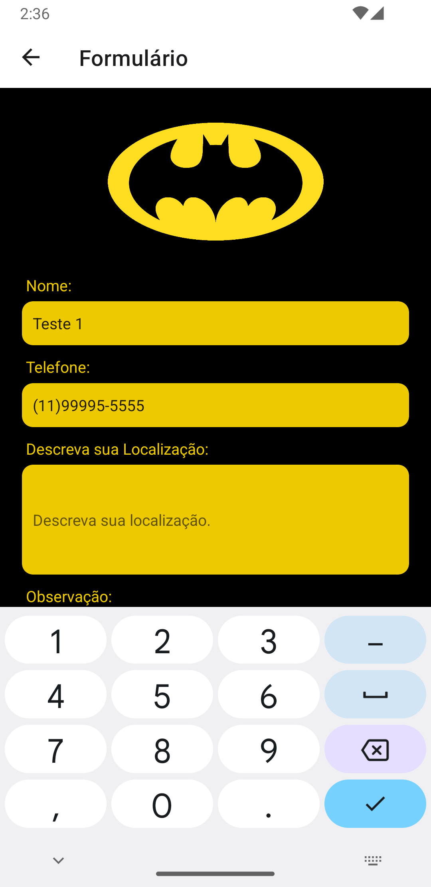
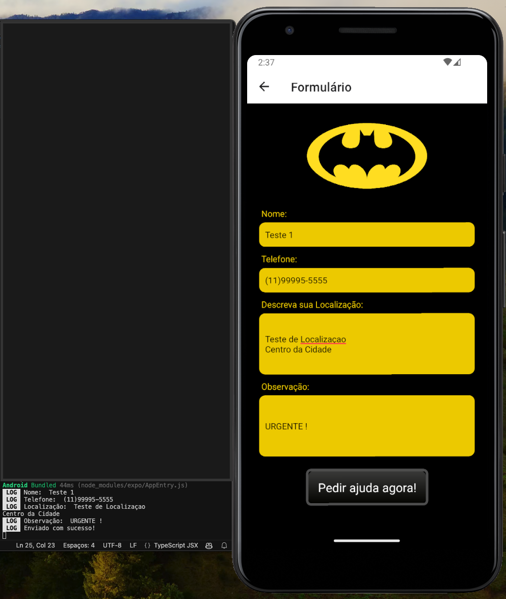

# Bat-Sinal
Este é um aplicativo React Native desenvolvido com TypeScript chamado Bat-Sinal. O aplicativo permite que os usuários peçam ajuda ao Batman enviando um formulário. App para fins didáticos como parte desafio do curso Dio.me

### Screenshot
<p float="left">





</p>


### Recursos
- Formulário para solicitar ajuda ao Batman
- Navegação entre páginas
- Máscara no campo de entrada do formulário

### Tecnologias utilizadas
- React Native
- TypeScript
- Expo
- React Navigation
- react-native-mask-text

### Como executar o projeto
Primeiro, clone o repositório para a sua máquina local usando git:
```
git clone https://github.com/edwinbustillos/bat-sinal-react-native.git
```

Navegue até o diretório do projeto:
```
cd bat-sinal
```

Instale todas as dependências do projeto:
```
npm install
```

Para iniciar o projeto, você pode executar:
```
npm run ios
npm run android
```

Isso iniciará o servidor de desenvolvimento Expo. Você pode agora abrir o aplicativo em um emulador ou em seu dispositivo físico escaneando o código QR fornecido pelo Expo.

### Contribuindo
Contribuições são sempre bem-vindas. Sinta-se à vontade para abrir uma issue ou enviar um pull request.